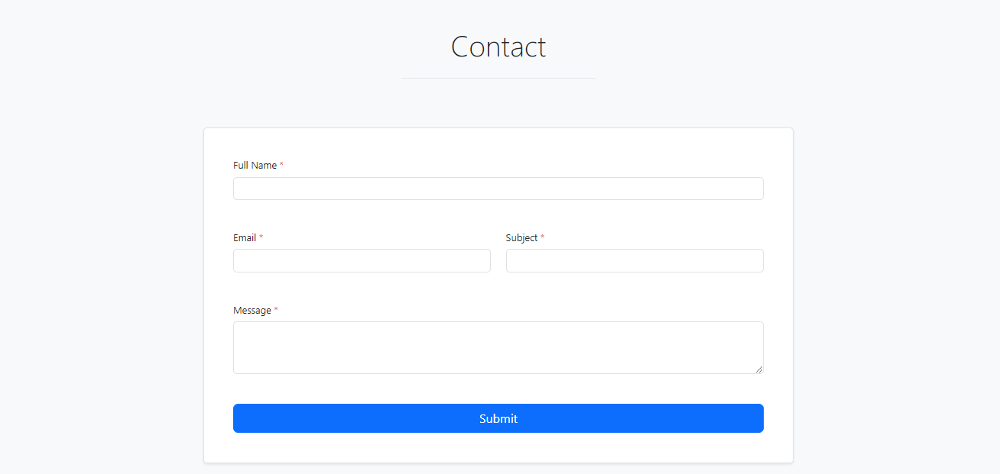
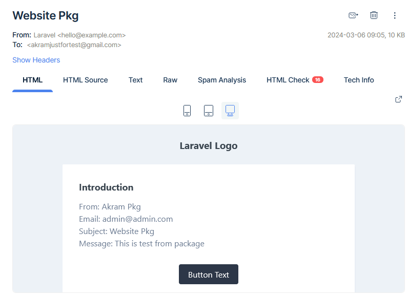

# Simple Contact Us Form Package

[](https://packagist.org/packages/akramghaleb/contact)
[](https://packagist.org/packages/akramghaleb/contact)

This will send email to admin and save contact data in the database.

## Installation

You can install the package via composer:

```bash
composer require akramghaleb/contact
```

Publish config:

```
php artisan vendor:publish --tag=contact-config
```

Run the database migrations (Set the database connection & Mail connection in .env before migrating)

```
php artisan migrate
```

Start the local development server

```
php artisan serve
```

You can now access the server at http://localhost:8000/contact

<br><br>

## Screenshots

| Web Screens                         |
|-------------------------------------|
|   |
|   |
